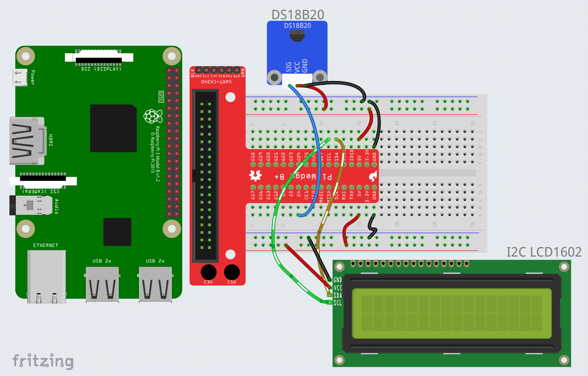

# Temperature Sensor With LCD1602

## About
This project will use DS18B20(temperature sensor) & LCD1602 work together to build a electronic thermometer.

Review [Demo.webm](Demo.webm) for final effect.

## Requires
- Raspberry Pi 3 B+
- LCD1602
- DS18B20(temperature sensor)

## Get start
### 1) Build circuit
|Pi     |Bread Board|DS18B20|LCD1602|
|------:|----------:|------:|------:|
|GPIO 7 |G4         |SIG    |       |
|5V(Any)|5V(Any)    |VCC    |       |
|GND(Any)|GND(Any)  |GND    |       |
|SCL    |SCL        |       |SCL    |
|SDA    |SDA        |       |SDA    |
|5V(Any)|5V(Any)    |       |VCC    |
|GND(Any)|GND(Any)  |       |GND    |



### 2) System setting
You should install DS18B20 as device before run program on Raspberry Pi

`
vi /boot/config.txt
`

Invite following line at the bottom then _save_&_quit_.

~~dtoverlay=w1-gpio~~

`
dtoverlay=w1-gpio-pullup,gpiopin=7 # change 7 to your gpio pin number
`

### 3) Reboot and verify device
Reboot Pi, when open the console, type following commands to install DS18B20.

```sh
sudo -i
modprobe w1-gpio
modprobe w1-therm
cd /sys/bus/w1/devices/
ls -l
```

You should see there are two follders returns.
- 28-XXXXXXXXXXXXX  is the SN of DS18B20
- w1_bus_master1

### 4) Upload source code & Execute
Upload all Python files under this path and start program by execute following command.

`
python3 temperature.py
`

## Trouble shooting
### 1) LCD1602 not work
To use LCD1602, make sure you have already allow the Raspberry Pi open I2C port. Consider use following command to open it.
`
sudo raspi-config
`
